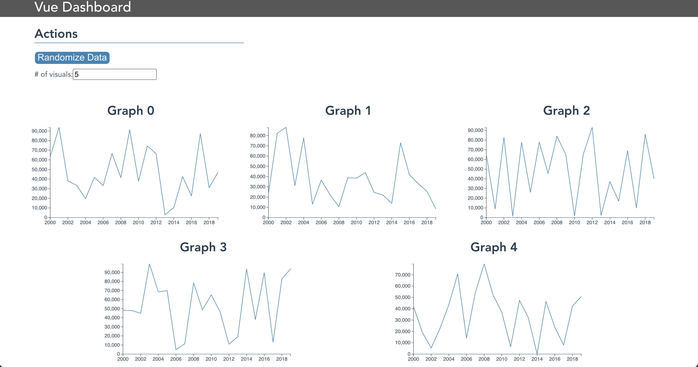

# linegraph
This is a Vue component for line graph data visualizations. It is currently undergoing development and will be published as an npm package upon completion. In the future it will be extended to bar graphs as well.

As a simple example, the following Vue.js section:
```
<div class="flex-row">
    <div class="flex-row-item" >
        <LineGraph :graphTitle="'Example 1'" />
    </div>
    <div class="flex-row-item" >
        <LineGraph :graphTitle="'Example 2'" />
    </div>
    <div class="flex-row-item" >
        <LineGraph :graphTitle="'Example 3'" />
    </div>
</div>
```

Will result in this:


This repository contains a demonstration app to explore and test out the component:


The aim of this component is to support:
- [ ] Multiple y-axes
- [ ] Multiple time series
- [ ] Hybrid line and bar graphs
- [ ] Customizable interactivity
- [ ] Custom datetime formatting


## Project setup
```
npm install
```

### Compiles and hot-reloads for development
```
npm run serve
```

### Compiles and minifies for production
```
npm run build
```

### Lints and fixes files
```
npm run lint
```

### Customize configuration
See [Configuration Reference](https://cli.vuejs.org/config/).
